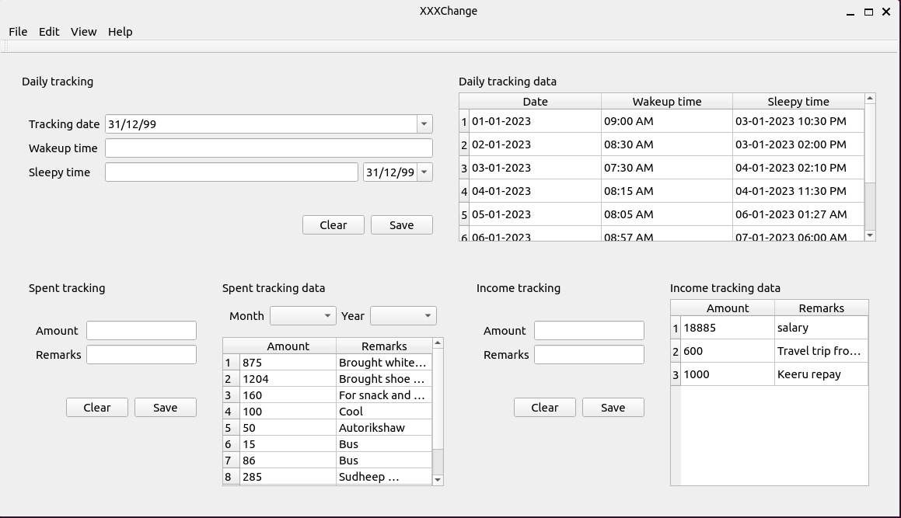

## XXXChange
\

\

# General
- Remove blank files from **resources** directory
- Remove debugger from `cli core`

### Development
---
- If running on a virtual enviornment make use of `setup.sh`

# Phase

- CLI 

- GUI 